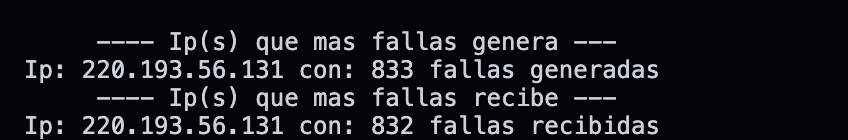
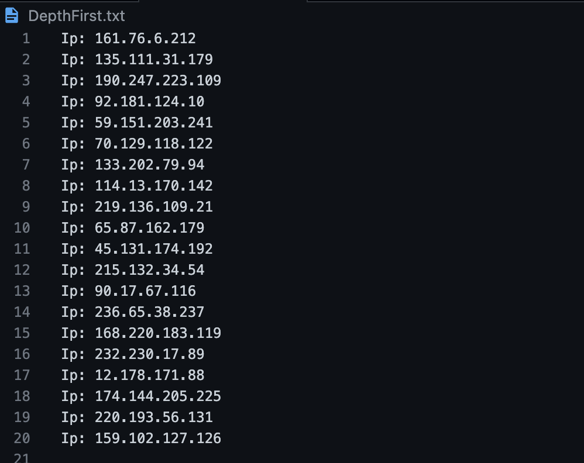

#   Data Structures Integrating Project

## Description

## Main Learnings 

## Installation
* Make sure to have installed a C++ enviroment 
* Download the repository on your local machine
* Run the command <code>./main</code> on the terminal located at the root path of the project or just open the <code>main.exe</code> file

## Screenshots
 
